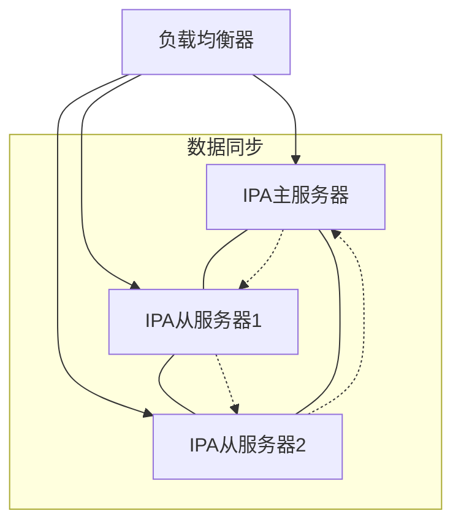

# FreeIPA 部署指南

> 版本: 2.1  
> 最后更新: 2026-04-12  
> 适用FreeIPA版本: 4.9.0+

## 初学者指南说明

本指南专为初学者设计，包含了详细的步骤说明和概念解释。在阅读和执行每个步骤时，请特别注意以下几点：

- **命令执行**：所有命令前带有 `sudo` 表示需要以管理员权限执行
- **配置文件**：修改配置文件时请备份原始文件
- **网络设置**：确保网络配置正确，这是 FreeIPA 部署成功的关键
- **密码安全**：为所有密码设置强密码，并妥善保管
- **日志查看**：遇到问题时，查看相关日志文件是解决问题的重要手段
- **版本兼容性**：确保使用的 FreeIPA 版本与操作系统版本兼容

## 什么是 FreeIPA？

FreeIPA 是一个开源的集成身份管理解决方案，它提供了以下核心功能：

- **身份管理**：集中管理用户、组、主机等身份信息
- **认证服务**：基于 Kerberos 的单点登录认证
- **授权控制**：基于角色的访问控制
- **证书管理**：内置的证书颁发机构（CA）
- **DNS 服务**：集成的 DNS 服务器
- **策略管理**：集中管理密码策略、访问控制策略等

FreeIPA 适用于企业环境，可帮助管理员简化身份管理和安全策略实施。

## 目录

1. [系统准备](#系统准备)
2. [安装配置](#安装配置)
3. [验证部署](#验证部署)
4. [高可用部署](#高可用部署)
5. [客户端加入](#客户端加入)
6. [运维管理](#运维管理)
7. [故障排除](#故障排除)
8. [最佳实践](#最佳实践)
9. [兼容性指南](#兼容性指南)
10. [使用案例](#使用案例)
11. [集成指南](#集成指南)

## FreeIPA架构概述


FreeIPA是一个集成的安全信息管理解决方案，结合了Linux（Fedora）、389 Directory Server、MIT Kerberos、NTP、DNS、Dogtag（证书系统）等组件。它提供了集中式的身份认证、授权和账户信息管理功能。

## 系统准备

### 硬件配置建议

| 部署规模 | CPU核心数 | 内存容量 | 存储空间 | 网络要求 |
|---------|----------|---------|----------|---------|
| 小型(<1000用户) | 2核+ | 4GB+ | 10GB+ | 千兆网卡 |
| 中型(1000-5000用户) | 4核+ | 8GB+ | 20GB+ | 千兆网卡 |
| 大型(5000+用户) | 8核+ | 16GB+ | 40GB+ | 万兆网卡 |

**初学者提示**：
- 对于测试环境，您可以使用最低配置（2核4GB内存）
- 对于生产环境，建议至少使用中型配置
- 存储空间应考虑数据增长和备份需求
- 网络带宽对认证性能有直接影响

### 操作系统要求

- 支持的操作系统:
  - RHEL 9.x (x86_64)
  - Rocky Linux 9.x (x86_64)
  - AlmaLinux 9.x (x86_64)
  - Fedora (最新版本)
- SELinux: enforcing或permissive模式
- 系统更新: 确保系统为最新状态

**初学者提示**：
- 推荐使用 Rocky Linux 或 AlmaLinux，它们是 RHEL 的社区版本，完全兼容且免费
- 确保选择的操作系统版本仍然在支持期限内
- 最小化安装操作系统，只安装必要的软件包

### 网络配置要求

- 静态IP地址配置（必须）
- 完全限定域名(FQDN)配置（必须）
- DNS正向和反向解析配置（必须）
- 所需端口开放:
  - TCP: 80 (HTTP), 443 (HTTPS), 389 (LDAP), 636 (LDAPS), 88 (Kerberos), 464 (Kerberos kpasswd)
  - UDP: 88 (Kerberos), 464 (Kerberos kpasswd), 123 (NTP)

**初学者提示**：
- FreeIPA 对网络配置要求较高，确保网络稳定
- 静态IP地址是必须的，不要使用动态IP
- FQDN 格式应为 `hostname.domain.com`，例如 `ipa1.mslinfo.lan`
- 确保DNS解析正常工作，这是 FreeIPA 部署成功的关键
- 提前测试网络连通性，确保所有必要端口都能正常访问

### DNS配置

1. 正向解析区域配置示例:

```bind
$ORIGIN mslinfo.lan.
$TTL 86400
@       IN      SOA     ipa1.mslinfo.lan. admin.mslinfo.lan. (
                        2026041201  ; Serial
                        3600        ; Refresh
                        1800        ; Retry
                        604800      ; Expire
                        86400       ; Minimum TTL
                        )
        IN      NS      ipa1
        IN      A       192.168.1.10
ipa1    IN      A       192.168.1.10
```

2. 反向解析区域配置示例:

```bind
$ORIGIN 1.168.192.in-addr.arpa.
$TTL 86400
@       IN      SOA     ipa1.mslinfo.lan. admin.mslinfo.lan. (
                        2026041201  ; Serial
                        3600        ; Refresh
                        1800        ; Retry
                        604800      ; Expire
                        86400       ; Minimum TTL
                        )
        IN      NS      ipa1.mslinfo.lan.
10      IN      PTR     ipa1.mslinfo.lan.
```

### 系统优化建议

1. 文件系统优化:

   ```bash
   # 调整nofile限制
   echo "* soft nofile 65536" >> /etc/security/limits.conf
   echo "* hard nofile 65536" >> /etc/security/limits.conf
   ```

2. 内核参数优化:

   ```bash
   cat >> /etc/sysctl.conf << EOF
   net.ipv4.tcp_keepalive_time = 300
   net.ipv4.tcp_keepalive_probes = 5
   net.ipv4.tcp_keepalive_intvl = 15
   EOF
   sysctl -p
   ```

### 安全基线配置

1. 最小化安装原则
2. 禁用不必要的服务
3. 配置NTP时间同步
4. 实施强密码策略
5. 定期系统更新

## 安装配置

### 基础安装

1. 更新系统:

   ```bash
   sudo dnf update -y
   ```

   **初学者提示**：这一步会更新系统的所有软件包，确保系统是最新状态，这对于安装 FreeIPA 非常重要。

2. 安装FreeIPA服务端:

   ```bash
   sudo dnf install -y ipa-server ipa-server-dns
   ```

   **初学者提示**：
   - `ipa-server` 是 FreeIPA 服务端核心包
   - `ipa-server-dns` 是集成的 DNS 服务包，推荐安装
   - 安装过程中会自动安装所有依赖包

3. 运行安装向导:

   ```bash
   sudo ipa-server-install
   ```

   **初学者提示**：
   - 这是一个交互式安装向导，会提示您输入各种配置信息
   - 安装过程中需要输入的信息包括：
     - Kerberos 领域名称（使用大写域名，如 MSLINFO.LAN）
     - DNS 域名（使用小写域名，如 mslinfo.lan）
     - Directory Manager 密码（用于管理 LDAP 目录，设置强密码）
     - IPA 管理员密码（用于管理 FreeIPA，设置强密码）
     - 是否配置集成 DNS 服务（建议选择是）
     - 是否设置 DNS 转发器（根据网络环境选择，如 8.8.8.8）

### 安装选项说明

| 选项 | 说明 | 建议值 |
|------|------|--------|
| --realm | Kerberos领域名称 | 大写域名(如MSLINFO.LAN) |
| --domain | DNS域名 | 小写域名(如mslinfo.lan) |
| --ds-password | Directory Manager密码 | 强密码(至少12位) |
| --admin-password | IPA管理员密码 | 强密码(至少12位) |
| --setup-dns | 配置集成DNS服务 | 建议启用 |
| --no-forwarders | 禁用DNS转发 | 根据需求选择 |
| --no-ntp | 禁用NTP配置 | 不建议使用 |

### 图形界面vs命令行安装对比

| 特性 | 图形界面 | 命令行 |
|------|----------|--------|
| 易用性 | 更友好 | 需要经验 |
| 自动化 | 不支持 | 支持 |
| 高级选项 | 有限 | 完整支持 |
| 远程安装 | 不适合 | 适合 |
| 批量部署 | 不适合 | 适合 |

### 防火墙配置

```bash
sudo firewall-cmd --add-service={freeipa-ldap,freeipa-ldaps,dns,ntp,http,https,kerberos} --permanent
sudo firewall-cmd --reload
```

## 验证部署

### 基础功能验证

1. 检查服务状态:

   ```bash
   sudo ipactl status
   ```

   **初学者提示**：
   - 这命令会显示 FreeIPA 所有服务的状态
   - 所有服务都应该显示为 "RUNNING"
   - 如果有服务未运行，检查日志文件找出原因

2. 测试管理员登录:

   ```bash
   kinit admin
   ```

   **初学者提示**：
   - `kinit` 是 Kerberos 认证命令，用于获取和缓存认证票据
   - 执行此命令后会提示输入 IPA 管理员密码
   - 如果认证成功，不会显示任何输出
   - 如果认证失败，会显示错误信息

3. 查看用户列表:

   ```bash
   ipa user-find
   ```

   **初学者提示**：
   - 此命令会显示 FreeIPA 中所有用户
   - 初始安装后，应该至少有一个 "admin" 用户
   - 如果命令执行成功，说明 FreeIPA 服务运行正常

### 服务检查清单

- [ ] Directory Server (LDAP)
- [ ] Kerberos KDC
- [ ] HTTP服务
- [ ] DNS服务
- [ ] NTP服务
- [ ] CA服务

## 高可用部署

### 架构设计



### 节点规划

1. 主节点配置
2. 复制节点部署
3. 负载均衡设置
4. 故障转移配置

### 多节点配置

1. 在主节点上安装FreeIPA服务端后，在副本节点上运行:

   ```bash
   sudo ipa-replica-install --setup-ca --setup-dns --no-forwarders
   ```

### 数据同步

- FreeIPA使用多主复制架构，数据变更会自动同步到所有节点
- 检查复制状态:

   ```bash
   ipa-replica-manage list
   ```

### 负载均衡配置

1. HAProxy配置示例:

   ```haproxy
   frontend freeipa_frontend
       bind *:443
       mode tcp
       default_backend freeipa_backend

   backend freeipa_backend
       mode tcp
       balance roundrobin
       server ipa1 192.168.1.10:443 check
       server ipa2 192.168.1.11:443 check
       server ipa3 192.168.1.12:443 check
   ```

2. DNS SRV记录配置:

   ```bind
   _ldap._tcp.mslinfo.lan. 86400 IN SRV 0 100 389 ipa1.mslinfo.lan.
   _ldap._tcp.mslinfo.lan. 86400 IN SRV 0 100 389 ipa2.mslinfo.lan.
   _ldap._tcp.mslinfo.lan. 86400 IN SRV 0 100 389 ipa3.mslinfo.lan.
   ```

### 故障转移测试

1. 模拟节点故障:

   ```bash
   sudo ipactl stop
   ```

2. 验证服务可用性:

   ```bash
   kinit admin
   ipa user-find
   ```

## 客户端加入

### Linux 客户端加入

#### RHEL/Rocky Linux/AlmaLinux 客户端

1. 安装客户端软件包:

   ```bash
   sudo dnf install -y ipa-client
   ```

2. 配置客户端:

   ```bash
   sudo ipa-client-install --domain mslinfo.lan --server ipa1.mslinfo.lan --realm MSLINFO.LAN -p admin -w password
   ```

   **参数说明**：
   - `--domain`：DNS 域名（如 mslinfo.lan）
   - `--server`：FreeIPA 服务器 FQDN（如 ipa1.mslinfo.lan）
   - `--realm`：Kerberos 领域名称（如 MSLINFO.LAN）
   - `-p`：管理员用户名（如 admin）
   - `-w`：管理员密码（或使用 `-k` 交互式输入，更安全）

3. 验证加入:

   ```bash
   # 测试 Kerberos 认证
   kinit username
   
   # 查看域信息
   ipa info
   ```

#### Ubuntu/Debian 客户端

1. 安装客户端软件包:

   ```bash
   sudo apt update
   sudo apt install -y freeipa-client
   ```

2. 配置客户端:

   ```bash
   sudo ipa-client-install --domain mslinfo.lan --server ipa1.mslinfo.lan --realm MSLINFO.LAN -p admin -w password
   ```

3. 验证加入:

   ```bash
   # 测试 Kerberos 认证
   kinit username
   
   # 查看域信息
   ipa info
   ```

### Windows 客户端加入

#### 通过 AD 信任加入

1. 在 FreeIPA 中建立与 Active Directory 的信任关系（如果需要）

2. 在 Windows 客户端上：
   - 打开「控制面板」→「系统和安全」→「系统」
   - 点击「更改设置」→「更改」
   - 选择「域」，输入域名 `mslinfo.lan`
   - 输入 FreeIPA 管理员凭据
   - 重启计算机

#### 直接 Kerberos 配置

1. 安装 MIT Kerberos for Windows

2. 配置 `krb5.ini` 文件：

   ```ini
   [libdefaults]
       default_realm = MSLINFO.LAN
       dns_lookup_realm = true
       dns_lookup_kdc = true

   [realms]
       MSLINFO.LAN = {
           kdc = ipa1.mslinfo.lan
           admin_server = ipa1.mslinfo.lan
       }

   [domain_realm]
       .mslinfo.lan = MSLINFO.LAN
       mslinfo.lan = MSLINFO.LAN
   ```

3. 测试 Kerberos 认证：

   ```cmd
   kinit username@MSLINFO.LAN
   ```

### 客户端配置验证

1. 检查 DNS 解析:

   ```bash
   nslookup ipa1.mslinfo.lan
   nslookup mslinfo.lan
   ```

2. 检查时间同步:

   ```bash
   timedatectl status
   ```

3. 检查 Kerberos 配置:

   ```bash
   klist
   ```

4. 检查 IPA 客户端状态:

   ```bash
   ipa-client-install --status
   ```

### 客户端加入常见问题

| 问题 | 原因 | 解决方案 |
|------|------|----------|
| DNS 解析失败 | DNS 配置错误 | 检查 /etc/resolv.conf 文件，确保指向正确的 DNS 服务器 |
| 时间不同步 | NTP 配置问题 | 配置 NTP 服务，确保客户端与服务器时间同步 |
| 认证失败 | 密码错误或用户不存在 | 验证用户名和密码，确保用户已在 FreeIPA 中创建 |
| 证书错误 | 证书不受信任 | 确保客户端信任 FreeIPA 服务器的证书 |

**初学者提示**：
- 确保客户端网络能够访问 FreeIPA 服务器的所有必要端口
- 客户端加入域后，用户可以使用 FreeIPA 凭据登录系统
- 对于 Linux 客户端，加入域后会自动配置 PAM 和 NSS，实现系统级别的认证集成

## 运维管理

### 日常管理操作

1. 用户管理:

   ```bash
   # 创建用户
   ipa user-add username --first=First --last=Last
   
   # 修改用户
   ipa user-mod username --title=Manager
   
   # 删除用户
   ipa user-del username
   ```

2. 组管理:

   ```bash
   # 创建组
   ipa group-add groupname
   
   # 添加成员
   ipa group-add-member groupname --users=username
   ```

3. 主机管理:

   ```bash
   # 添加主机
   ipa host-add hostname.example.com
   
   # 删除主机
   ipa host-del hostname.example.com
   ```

### 备份和恢复

1. 完整备份:

   ```bash
   sudo ipa-backup
   ```

   **初学者提示**：默认备份位置为 `/var/lib/ipa/backup/`

2. 选择性备份:

   ```bash
   sudo ipa-backup --data --online
   ```

   **初学者提示**：`--online` 选项表示在线备份，不会中断服务

3. 恢复:

   ```bash
   sudo ipa-restore /var/lib/ipa/backup/ipa-full-2026-04-12-12-00
   ```

   **初学者提示**：
   - 恢复前请停止 FreeIPA 服务
   - 恢复后需要重新启动服务
   - 确保使用正确的备份文件路径

### 监控方案

1. 服务监控:
   - Nagios/Zabbix模板
   - 服务状态检查
   - 证书过期监控

2. 性能监控:
   - LDAP连接数
   - 认证请求量
   - 复制延迟

3. 日志监控:
   - 认证失败
   - 复制错误
   - 证书操作

### 性能优化

1. LDAP优化:

   ```bash
   # 调整数据库缓存
   ldapmodify -x -D "cn=directory manager" -W
   dn: cn=config
   changetype: modify
   replace: nsslapd-dbcachesize
   nsslapd-dbcachesize: 2097152
   ```

2. Kerberos优化:

   ```bash
   # 修改krb5.conf
   [libdefaults]
   udp_preference_limit = 1
   ```

### 安全加固

1. 密码策略:

   ```bash
   ipa pwpolicy-mod global --maxlife=90 --minlife=1 --history=10
   ```

2. 访问控制:

   ```bash
   # 限制登录时间
   ipa hbacrule-add business_hours
   ipa hbacrule-add-time business_hours --timeofday="0900-1700"
   ```

## 故障排除

### 常见问题诊断流程

1. 检查服务状态
2. 查看系统日志
3. 验证网络连接
4. 检查DNS解析
5. 验证证书状态

### 日志分析

重要日志文件:

- /var/log/dirsrv/slapd-INSTANCE/access
- /var/log/dirsrv/slapd-INSTANCE/errors
- /var/log/krb5kdc.log
- /var/log/httpd/error_log
- /var/log/ipaserver-install.log

### 问题排查清单

- [ ] 服务状态检查
- [ ] DNS解析验证
- [ ] 网络连通性测试
- [ ] 证书有效性检查
- [ ] 时间同步验证
- [ ] SELinux状态检查
- [ ] 防火墙规则验证

### 常见错误码

| 错误码 | 描述 | 解决方案 |
|--------|------|----------|
| 1 | 一般错误 | 检查日志获取详细信息 |
| 13 | 权限拒绝 | 检查用户权限和SELinux |
| 49 | 认证失败 | 验证用户凭据 |
| 68 | 服务不可用 | 检查服务状态和网络 |

## 最佳实践

### 安全配置建议

1. 启用TLS加密
2. 实施强密码策略
3. 定期更新证书
4. 限制管理员访问
5. 启用双因素认证

### 性能优化建议

1. 合理配置缓存大小
2. 优化索引
3. 调整连接池
4. 配置合适的复制拓扑
5. 实施负载均衡

### 运维管理建议

1. 制定备份策略
2. 建立监控体系
3. 规范变更流程
4. 做好文档记录
5. 定期进行演练

### 备份策略建议

1. 每日增量备份
2. 每周完整备份
3. 异地备份存储
4. 定期备份测试
5. 建立恢复流程

### 扩展性建议

1. 预留资源空间
2. 模块化设计
3. 自动化部署
4. 标准化配置
5. 容灾设计

## 兼容性指南

### 服务器兼容性

| FreeIPA 版本 | 支持的操作系统版本 | 最低硬件要求 |
|-------------|-------------------|-------------|
| 4.9.x | RHEL 8.x, Rocky Linux 8.x, AlmaLinux 8.x | 2核4GB内存 |
| 4.10.x+ | RHEL 9.x, Rocky Linux 9.x, AlmaLinux 9.x | 2核4GB内存 |
| 4.11.x+ | Fedora 36+, RHEL 9.2+ | 2核4GB内存 |

**初学者提示**：
- 始终使用与操作系统版本兼容的 FreeIPA 版本
- 建议使用最新的稳定版本，以获得最佳的安全性和功能
- 升级前请查阅官方发布说明，了解版本兼容性和升级路径

### 客户端兼容性

#### Linux 客户端

| 操作系统 | 支持的版本 | 客户端包 |
|---------|-----------|----------|
| RHEL/CentOS | 7.x, 8.x, 9.x | ipa-client |
| Rocky Linux | 8.x, 9.x | ipa-client |
| AlmaLinux | 8.x, 9.x | ipa-client |
| Fedora | 最新版本 | ipa-client |
| Ubuntu | 20.04 LTS+, 22.04 LTS+ | freeipa-client |
| Debian | 10+, 11+ | freeipa-client |

#### Windows 客户端

| Windows 版本 | 支持的版本 | 客户端软件 |
|-------------|-----------|------------|
| Windows 10 | 1809+ | Active Directory 集成 + Kerberos 配置 |
| Windows 11 | 所有版本 | Active Directory 集成 + Kerberos 配置 |
| Windows Server | 2016+, 2019+, 2022+ | Active Directory 集成 + Kerberos 配置 |

**初学者提示**：
- Windows 客户端需要通过 AD 信任或直接 Kerberos 配置来与 FreeIPA 集成
- 对于 Ubuntu/Debian 客户端，需要安装 `freeipa-client` 包
- 确保客户端时间与服务器时间同步，这对于 Kerberos 认证至关重要

### 浏览器兼容性

| 浏览器 | 支持的版本 | 注意事项 |
|--------|-----------|----------|
| Chrome | 最新版本 | 推荐使用 |
| Firefox | 最新版本 | 推荐使用 |
| Edge | 最新版本 | 支持 |
| Safari | 最新版本 | 基本支持 |

**初学者提示**：
- 始终使用最新版本的浏览器，以获得最佳的安全性和兼容性
- 确保浏览器信任 FreeIPA 服务器的证书

### API 兼容性

| API 版本 | FreeIPA 版本 | 支持状态 |
|----------|-------------|----------|
| v1 | 4.0+ | 已弃用 |
| v2 | 4.4+ | 稳定 |
| v2.23+ | 4.9+ | 最新稳定版 |

**初学者提示**：
- 使用最新的 API 版本以获得最佳功能和安全性
- 查阅官方 API 文档了解详细的 API 用法

### 数据库兼容性

| 数据库 | 支持的版本 | 用途 |
|--------|-----------|------|
| 389 Directory Server | 1.4+ | LDAP 目录服务 |
| MariaDB/MySQL | 5.5+, 10.0+ | 可选，用于某些扩展 |

**初学者提示**：
- FreeIPA 主要使用 389 Directory Server 存储数据
- 不需要单独安装数据库，FreeIPA 安装过程会自动配置所需的数据库服务

## 使用案例

### 企业身份管理

1. 集中式用户管理
2. 统一认证平台
3. 权限分级控制
4. 审计日志记录

### 集中式认证

1. SSH密钥管理
2. SUDO规则控制
3. PAM配置集成
4. 单点登录实现

### 证书管理

1. 证书签发
2. 证书续期
3. 证书吊销
4. 证书分发

### 安全策略实施

1. 密码策略
2. 访问控制
3. 主机管理
4. 服务管理

### 多站点部署

1. 站点规划
2. 复制策略
3. 流量控制
4. 故障转移

## 集成指南

### 与Active Directory集成

1. 信任关系建立
2. 用户同步配置
3. 密码同步设置
4. 域控制器设置

### 与其他LDAP系统集成

1. Schema映射
2. 属性同步
3. 认证配置
4. 数据迁移

### 与SSO系统集成

1. SAML配置
2. OAuth设置
3. OpenID Connect
4. Kerberos集成

### 与监控系统集成

1. Nagios/Zabbix配置
2. 监控指标定义
3. 告警规则设置
4. 报表生成

### 与自动化工具集成

1. Ansible集成
2. Puppet集成
3. Chef集成
4. API使用指南
